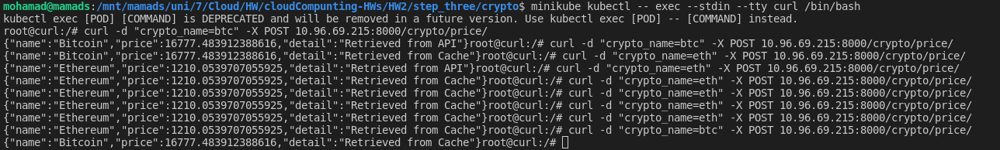
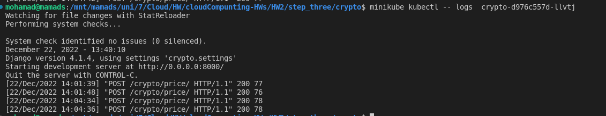
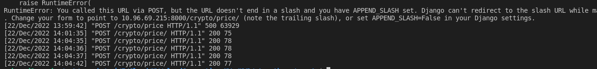

# Step four

In this step we will run first app in a kubernetes cluster.
and request with curl to get btc data.

## 4.1 run app in kubernetes cluster

```bash
minikube kubectl -- run curl --image=mohamadch91/curln --restart=Never 
minikube kubectl -- exec --stdin --tty curl /bin/bash
```

## 4.2 check result

```bash
minikube kubectl -- get all
```

**then** 

```bash
minikube kubectl -- logs ${POD_NAME} 

```

### Results

**requests with curl container to service**



**requests go to pod1**



**requests go to pod2**



we can see that requests go to pod1 and pod2 and balance between them.