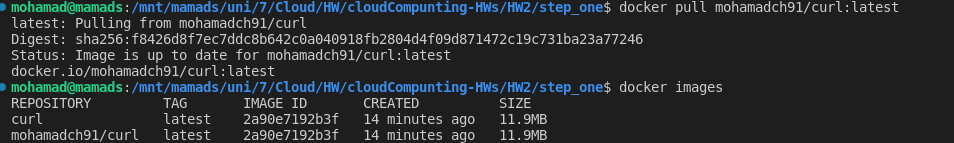
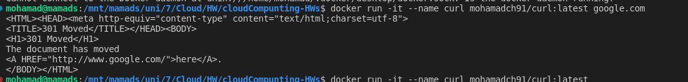
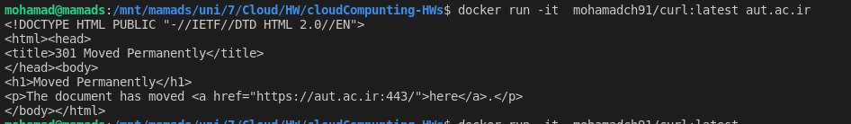

# Step one

In this step we will create a simple Docker image that will contain a CURL command line tool to send a request to the google.com website.
then we will upload the image to the docker hub.
pull  the image from the docker hub and create container from it.

run the container and send a request to the google.com website.


## 1.1

first we need too create Dockerfile with alpine base image and install curl package.

```Dockerfile
FROM alpine:latest
RUN apk add --update curl
ENTRYPOINT ["curl"]
```

## 1.2

now we need to push the image to the docker hub.

```bash
docker build -t curl .
docker tag curl:latest mohamadch91/curl:latest
docker push mohamadch91/curl:latest
```
### Results


## 1.3

now we need to pull the image from the docker hub and create container from it.


since we have image on local , delete image from local 

```bash
docker rmi mohamadch91/curl:latest
```
### Results


then we pull the image and run it
    

```bash
docker pull mohamadch91/curl:latest
docker run -it --name curl mohamadch91/curl:latest google.com
```
### Results





