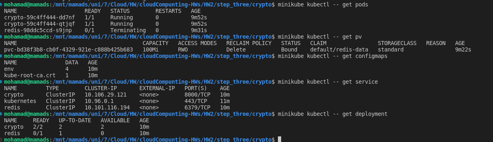
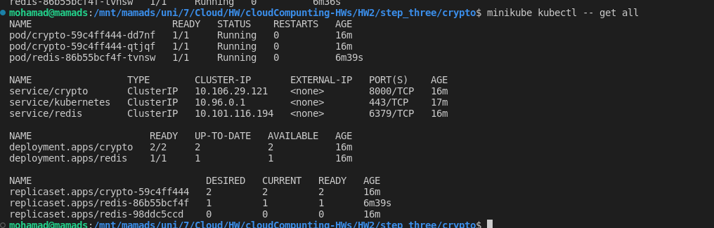
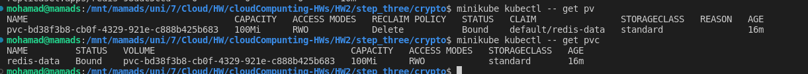
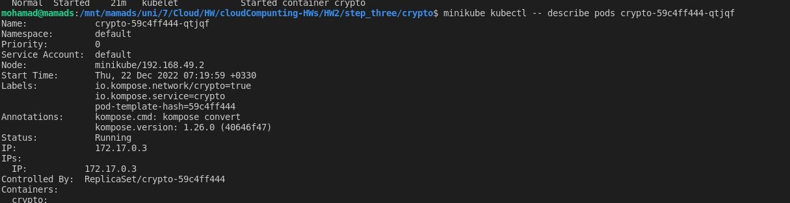
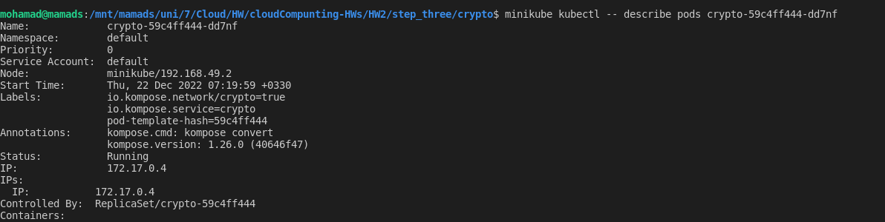

# Step three

In this step we need to run step two app in a kubernetes cluster.

## Prerequisites

* [Docker](https://docs.docker.com/install/)
* [Kubernetes](https://kubernetes.io/docs/tasks/tools/install-kubectl/)
* [Minikube](https://kubernetes.io/docs/tasks/tools/install-minikube/)
* [Step two](../step_two/README.md)
  
## 3.1 Download minikube

Download minikube from [here](https://minikube.sigs.k8s.io/docs/start/)

or you can use this command:

```bash
docker pull kicbase/stable:v0.0.36
```

## 3.2 Start minikube

```bash
minikube start --driver=docker
```
## 3.3 Install kompose

```bash
curl -L https://github.com/kubernetes/kompose/releases/download/v1.26.0/kompose-linux-amd64 -o kompose

chmod +x kompose
sudo mv ./kompose /usr/local/bin/kompose
```

## 3.4 Run kompose 

convert docker-compose.yml to kubernetes resources

```bash
kompose convert
```

## 3.5 Run kubernetes resources

```bash
kubectl apply -f .
```

## 3.6 Check kubernetes resources

```bash
kubectl get all
```

### Results







first pod ip 



second pod ip


