# Step two

In this step we wiil create a CryptoCurrency market price tracker. We will use redis as a database and python as a programming language.

also we will use docker to run redis and python-Django.

use redis cache to store data and use Django  to get data from API and show it to user.

also use docker Volumes to store data in host machine.

also we  nedd to create config file for redis annd Django.

config file contains : 

- Django server port
- redis keys expire time : default 5 minutes
- CoinAPI API key


- [Step two](#step-two)
  - [2.1](#21)
    - [Result](#result)
  - [2.2](#22)
    - [2.2.1](#221)
    - [2.2.2](#222)
      - [2.2.2.1](#2221)
      - [Results](#results)
    - [2.2.3](#223)
    - [2.2.4](#224)
    - [2.2.5](#225)
      - [Result](#result-1)
    - [2.2.6](#226)
      - [Result](#result-2)
  - [2.3](#23)
      - [2.3.1](#231)
  - [2.4](#24)
    - [Result](#result-3)
  - [2.5](#25)
    - [Result](#result-4)
  - [2.6](#26)
  - [2.7](#27)
    - [Results](#results-1)
  - [Report details](#report-details)
    - [Inspect server](#inspect-server)
    - [Containers list](#containers-list)
    - [System stats](#system-stats)


## 2.1

First we need to pull redis image and make container from pulled image

```bash
docker pull redis
docker run --name redis_net -d redis
```

### Result

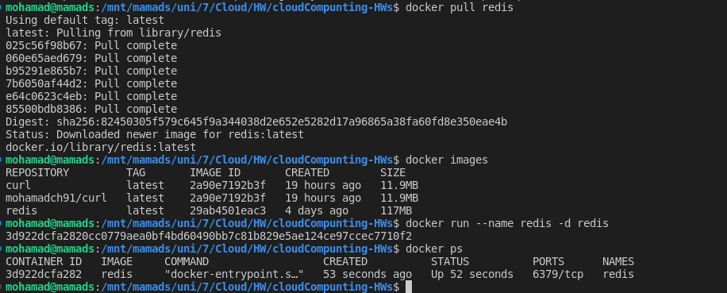
## 2.2
In this step we will create Django project and app and make image from it.
then push this image to docker hub.
### 2.2.1

Create a Django project

```bash
django-admin startproject crypto
```
### 2.2.2

Create a Django app

```bash
cd crypto
python manage.py startapp cryptoApp
```
#### 2.2.2.1 

Create a class in [Views.py](./crypto/cryptoApp/views.py) file
for get data from API and show it to user

and create a [urls.py](./crypto/cryptoApp/urls.py) file for routing

create Serializer class in [serializers.py](./crypto/cryptoApp/serializers.py) file for serialize data

change [settings.py](./crypto/crypto/settings.py) file for add app 

and add [urls.py](./crypto/crypto/urls.py) file for routing

#### Results

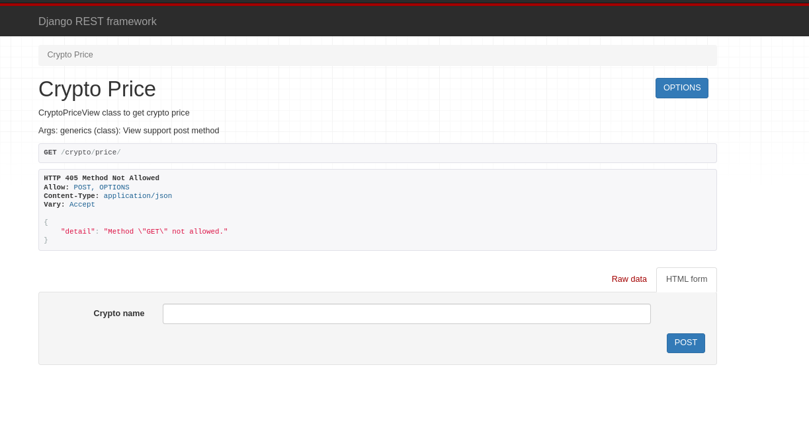


### 2.2.3
Create a requirements.txt

```bash
Django==4.1.4
django-cors-headers==3.13.0
djangorestframework==3.13.1
requests==2.26.0
requests-toolbelt==0.9.1
requests-unixsocket==0.2.0
redis==3.5.3
```


### 2.2.4

Create a Dockerfile in crypto directory
and run Django server

```bash
FROM python:3.8
ENV PYTHONUNBUFFERED 1
RUN mkdir /code
WORKDIR /code
COPY requirements.txt /code/
RUN pip install -r requirements.txt
COPY . /code/
CMD python manage.py runserver

```

### 2.2.5

Make image from Dockerfile

```bash
docker build -t crypto .
```
#### Result

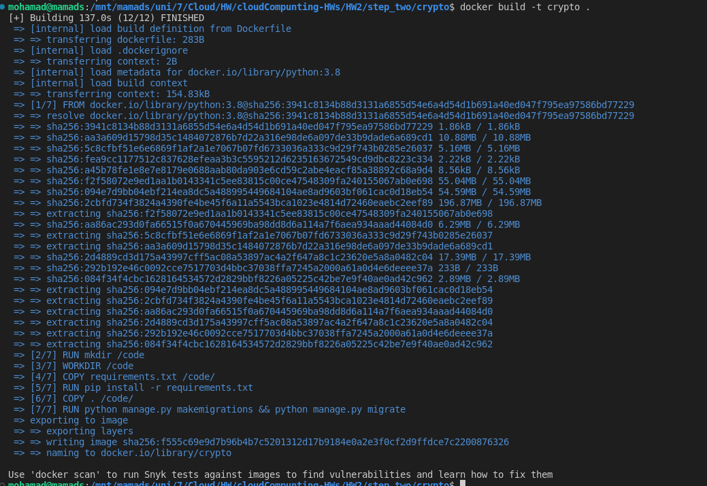


### 2.2.6

Push image to docker hub

```bash
docker tag crypto:latest mohamadch91/crypto:latest
docker push mohamadch91/crypto:latest
```
#### Result

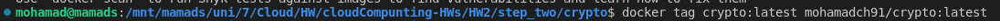
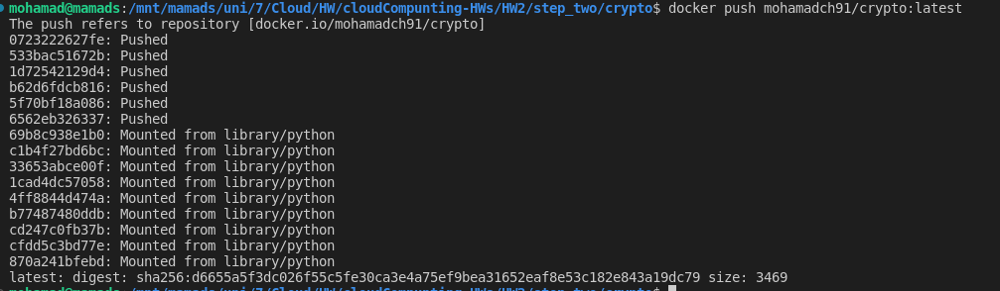
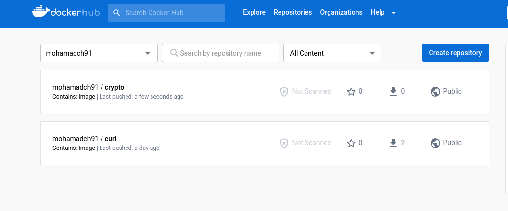


## 2.3
In this step we need to create config file for Django and redis

Create a .env file for Django and redis in Dockerfile

```bash
CACHE_TTL=300
REDIS_HOST=redis
REDIS_PORT=6379
DJANGO_PORT=8000
COINAPI_KEY=YOUR_API
```


#### 2.3.1
Change [setting.py](./crypto/crypto/settings.py) file for env

```python

runserver.default_port = os.environ.get('DJANGO_PORT', '8001')

COINAPI_KEY = os.environ.get('COINAPI_KEY', 'Your key')

CACHE_TTL=os.environ.get('CACHE_TTL', '350')

```

## 2.4
In this step we need to create volumes for redis 
    
    ```bash
    docker volume create redis_data
    ```

### Result

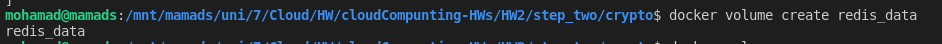

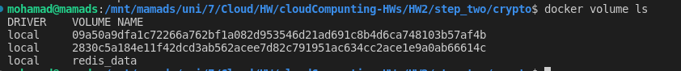
## 2.5
In this step we need to create network for redis and Django

```bash
docker network create crypto
```

### Result

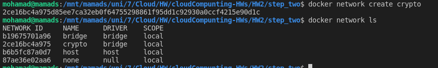


## 2.6
now we need to write docker-compose.yml file for run redis and Django
to volume and network
- [compose file](./crypto/docker-compose.yml)


## 2.7 
now we run de compose file 

```bash
docker compose up -d 
```

### Results

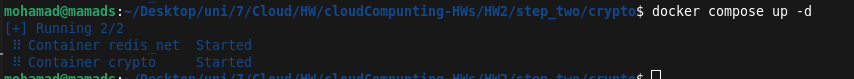

- [env file](./crypto/.env)

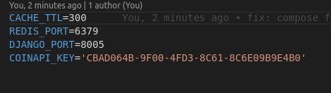


we see upcoming on port 8005 

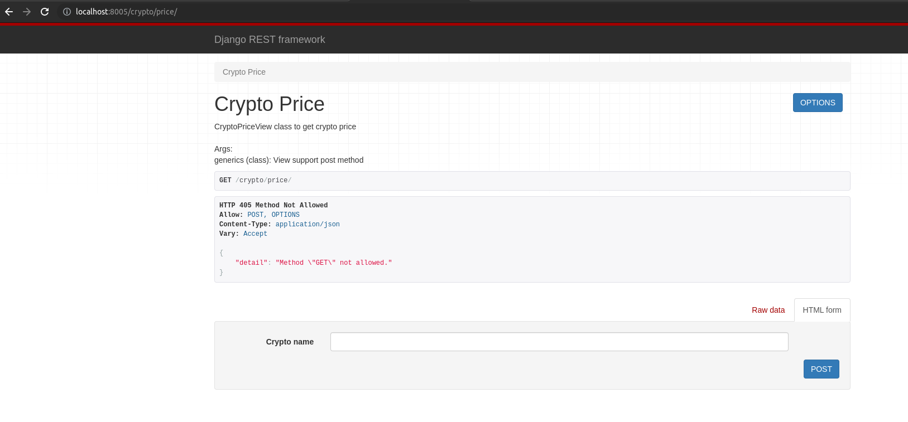


**Get btc data**

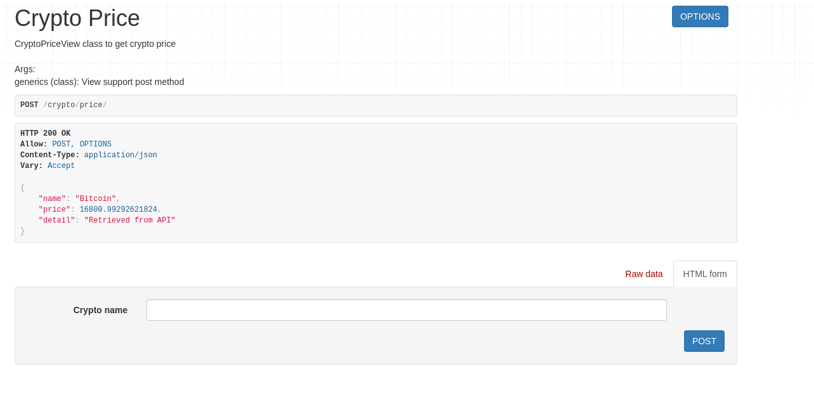

**Get btc for second time**

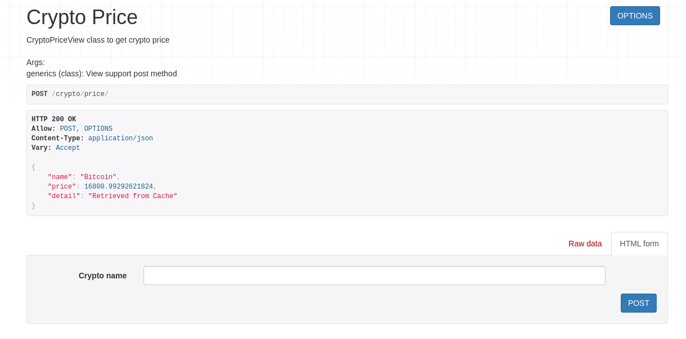

**Remove redis**

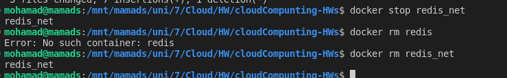

**API response on no redis**

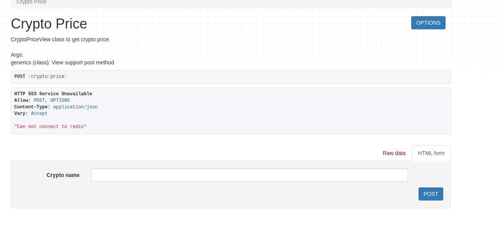

**Start again redis and check API**

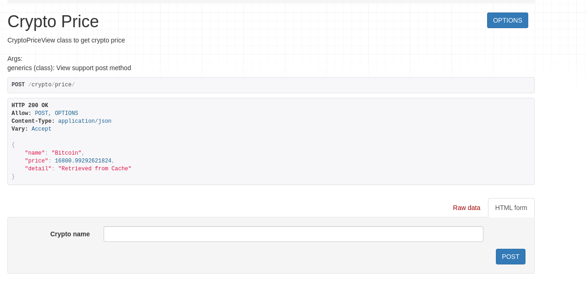


## Report details

### Inspect server 

Inspect server image with 

```bash
docker image inspect mohamadch91/crypto
```

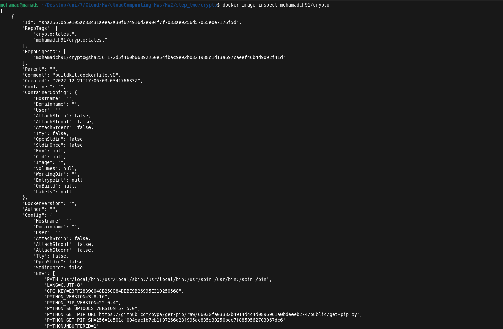
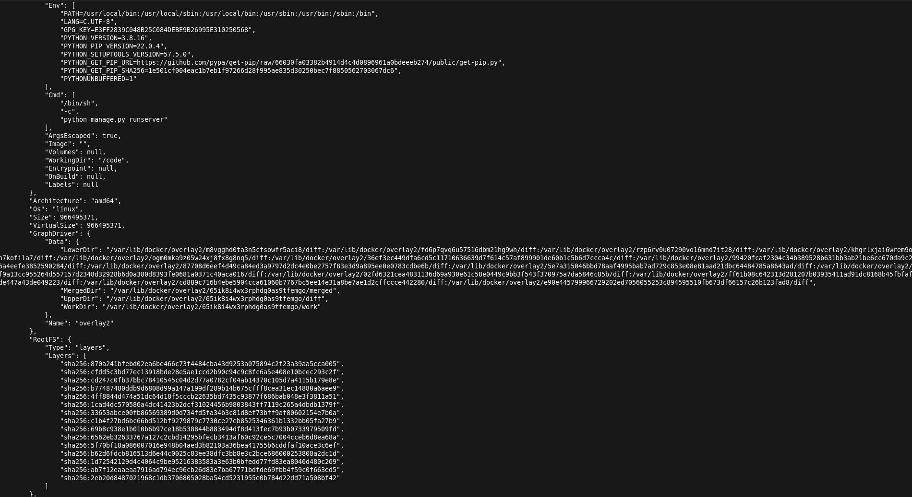

### Containers list

get list of containers

```bash
docker ps

```

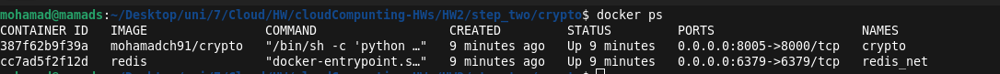


### System stats

get status of system with

```bash

docker stats

```

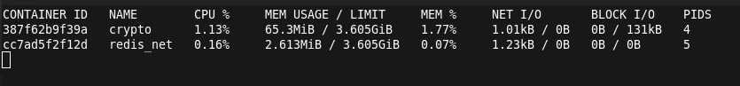
